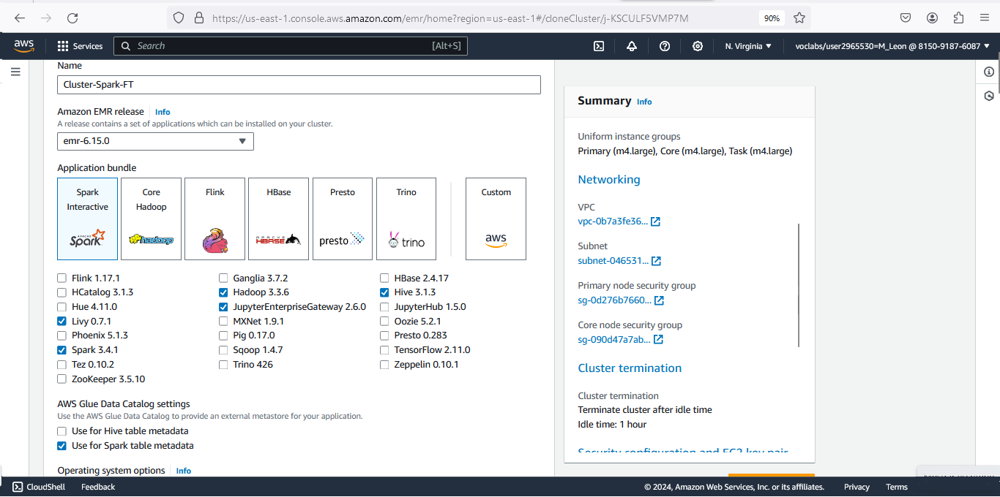
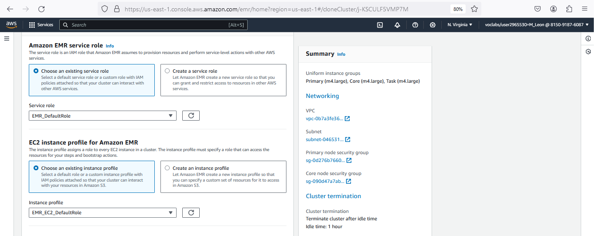
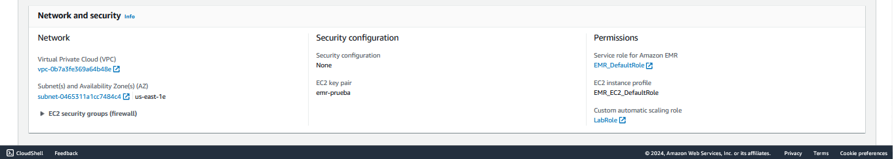
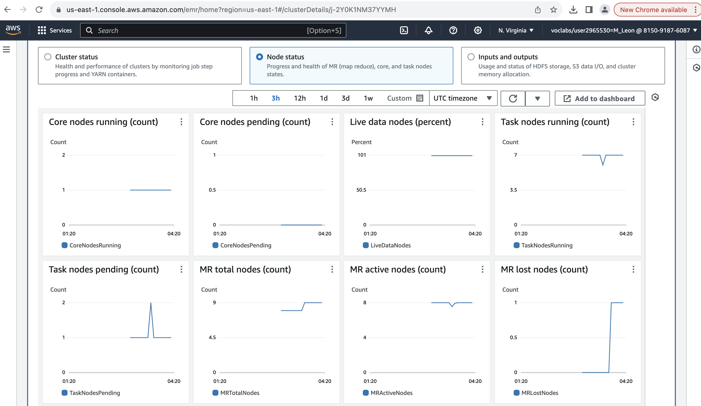

# Non-functional properties of Distributed Systems in AWS EMR
**Author:** Marcel León Lafebré

**Introduction**

This guide lets students observe and analyze some non-functional properties of Distributed
Systems, including performance, fault tolerance, and scalability, through a series of hands-on
experiments. The experiments involve executing SQL queries on a data lake, using Apache
Spark on AWS EMR.

The following sections outline the teaching objectives of this guide and highlight the intended
audience and prerequisites. This laboratory guide has been designed for execution within an
AWS Academy Learner Lab environment.

**Objectives**

This laboratory guide will teach you how to:
* Use AWS services such as Athena and EMR for the analysis of large data volumes, and
the Cloudwatch tool to monitor metrics of an EMR cluster.
* Prepare an environment for benchmarking a Big Data platform with the benchmark
“TPC-DS” on AWS.
* Configure and launch an Elastic MapReduce (EMR) cluster running Spark.
* Measure the performance of an EMR cluster.
* Observe how an EMR cluster uses redundancy to achieve fault tolerance behavior.
* Observe the scalability of an EMR cluster.

**Intended audience**

This laboratory guide is tailored for students pursuing undergraduate or graduate studies in
Computer Science or related programs, who are interested in gaining practical experience in
deploying an EMR cluster in AWS and understanding the impact of different configuration options on
the non-functional properties of these clusters.

**Prerequisites**

We recommend that students have prior knowledge of Distributed Systems and Big Data concepts,
as well as familiarity with AWS academy and to run the Lab Environment furthermore the AWS tools
and services. Specifically the creation of rules to enable server ports and access from specific IPs,
as well as using key pairs to access the nodes. Students can refer to the Appendix section if
needed.

# Sections
This guide has the following key sections:
1. [Process for setting up an environment with TPC-DS in AWS for benchmarking Big Data querying platforms.](#process-for-setting-up-an-environment-with-tpc-ds-in-aws-for-benchmarking-big-data-querying-platforms)
2. [Configure and run an EMR Cluster with access to the TPC-DS Big Data repository.](#demostration-of-cluster-concept)
3. [Observe the fault tolerance of an EMR cluster.](#setup-and-run-emr-cluster-with-access-to-the-tpcds-big-data-repository)
4. [Observe measurements of the performance of an EMR Cluster using CloudWatch.](#demostration-of-performance)
5. [Observe the scalability of an EMR cluster.](#demostration-of-fault-tolerance)
6. [Appendix: Pre-requisite knowledge; refer to this section if it is unclear how to execute one or more steps in the guide.](#demostration-of-fault-tolerance)
7. [References.](#references)
   
## Process for setting up an environment with TPC-DS in AWS for benchmarking Big Data querying platforms

This exercise must be carried out in an AWS Academy Learner Lab environment. First, you
need to set up an S3 bucket and configure Athena, as described below:

1\. Create an **Amazon S3 bucket** using S3 service with default permissions and the name that
you decide (being a string unique in your environment), for example **_“athenabucketmll”_** where
you could replace **_“mll”_** with the initials of your name.

The following image shows the S3 bucket created.

2\. Go to the Athena Service and access the SQL query editor, then you have to configure it
using **_"Edit Settings"_**. Assign the bucket created in the field query result location, note that you
can write the location or select it in a search.
.
Once Athena is configured, continue with the following steps of the lab:

3\. This work uses the official repository of [AWS Labs for Redshift utils](https://github.com/awslabs/amazon-redshift-utils/tree/master/src/CloudDataWarehouseBenchmark/Cloud-DWB-Derived-from-TPCDS/1TB), specifically employing
the **_1 TB TPC-DS_** which is an industry-standard benchmark to evaluate the performance of
systems for big data analytics; it simulates the data and typical queries of the data warehouse,
offering different sizes of information. In summary, it provides us with data to test systems
related to information consumption with Big Data queries. The script file ddl.sql contains the
commands to create the database tables on Redshift, an AWS product designed for storing
large data volumes but in this case, you will adapt to run in Athena as a datasource.

4\. These tables are created as files stored on S3. For this, you will use Athena to execute the
scripts, but you need to make a few changes first.
* Create a database with the following code:
```
CREATE DATABASE tpcds_1tbrs;
```


5\. The ddl file contains CREATE statements which you should modify as indicated below:
* In each **“CREATE”** statement, replace **“CREATE TABLE”** with **"create external
table"**. This is needed because the data files are stored in an external bucket that you
do not own.

6\. Inside the CREATE statement you will find the definition of each field of the table with its
name followed by the datatype. You will modify:
* The data types **_"integer"_**, **_"int8"_** or **_"int4"_** by **_"int"_**, and
* The data types **_"numeric"_** by **_"decimal"_** with the same precision described after the data
type inside parenthesis.

This is needed because are the data types accepted by Athena.
7\. Also, inside the CREATE statement you will have to modify the following:
* **_Delete_** the **_definitions_** of **_"primary key"_** because Athena does not enforce primary keys.
* **_Delete_** the **_null fields_** **_definitions_** to match with the data of the benchmark TPC-DS.
* **_Delete_** the following **_declarations: diststyle, distkey_**, and **_sortkey_** because they are
specific commands for Redshift.
Insert the following **_code block_** at the end with important properties of the tables as the
format or compression type. You have to refer to the link of the S3 file published by the
TPC-DS framework for the data population e.g.
s3://redshift-downloads/TPC-DS/2.13/1TB/**_date_dim_**/. Take into account that the file
name (in bold and italic: date_dim) changes depending on the table and the link must go
between quotes.
```
  ROW FORMAT SERDE 'org.apache.hadoop.hive.serde2.lazy.LazySimpleSerDe'
WITH SERDEPROPERTIES ('field.delim' = '|')
STORED AS INPUTFORMAT 'org.apache.hadoop.mapred.TextInputFormat'
OUTPUTFORMAT 'org.apache.hadoop.hive.ql.io.HiveIgnoreKeyTextOutputFormat'
LOCATION 's3://redshift-downloads/TPC-DS/2.13/1TB/date_dim/'
TBLPROPERTIES (
  'classification' = 'csv',
  'write.compression' = 'GZIP'
);
```
For example, the following code is similar to the original file and highlights the words to change:
```
   create table tabla_ejemplo(
   field1 **integer**,
   field2 **int8**,
   field3 **int4**,
   field4 **numeric**(4,2));
```
The following text shows the example of the final script highlighting in bold the words added or
changed:
```
create external table tabla_ejemplo(
field1 int,
field2 int,
field3 int,
field4 decimal(4,2)) ROW FORMAT SERDE
'org.apache.hadoop.hive.serde2.lazy.LazySimpleSerDe'
WITH SERDEPROPERTIES ('field.delim' = '|')
STORED AS INPUTFORMAT 'org.apache.hadoop.mapred.TextInputFormat'
OUTPUTFORMAT 'org.apache.hadoop.hive.ql.io.HiveIgnoreKeyTextOutputFormat'
LOCATION 's3://redshift-downloads/TPC-DS/2.13/1TB/tabla_ejemplo/'
TBLPROPERTIES ( 'classification' = 'csv', 'write.compression' = 'GZIP'
);
```
8\. The script will run in Athena and must reply **_“Query successful”_**.


9\. Repeat the modification of the script and its execution for every table of the TPC-DS
repository, ensuring that database tpcds_1tbrs is selected in the combo box labeled Database.
In our experiment, we initially will create five tables: **date_dim, item, inventory, and
warehouse**, which are used in **query number 21** in this repository https://github.com/awslabs/amazon-redshift-utils/tree/master/src/CloudDataWarehouseBenchmark/Cloud-DWB-Derived-from-TPCDS/1TB/queries.

The script of query number 21 has been chosen as a goal of running it because in the following
research was not possible to execute it in an EMR Cluster with Spark:
https://www.concurrencylabs.com/blog/starburst-enterprise-vs-aws-emr-sql-tpcds/. However,
you can use any query that takes at least 3 minutes in Athena.

10\. After executing the previous steps, the tables will be ready to be accessed via the data
source type: AWS Glue Data Catalog, enabling the TPC-DS data to be accessible from the
EMR Clusters by only marking the check of one property when you create the cluster.

## Configure and run an EMR Cluster with access to the TPC-DS Big Data repository
We recommend to read the official documentation about Architecture of EMR Cluster for understand the functioning of the AWS EMR Cluster service in the following links: https://docs.aws.amazon.com/emr/latest/ManagementGuide/emr-overview-arch.html https://docs.aws.amazon.com/emr/latest/ManagementGuide/emr-what-is-emr.html
Is important to mention that the AWS service of EMR Cluster can provide some types of tecnologies being the main: Hadoop, Presto or Spark, we use this last because of best times of excecution of querys in another work related.

## Setup and run emr cluster with access to the tpcds big data repository
The following images show the main configurations to set up a Cluster of EMR of Apache Spark:

1\. After of making click in "Create Cluster" into the EMR Cluster service will appear the next screen, you have to enter a name for the cluster, then by default will be choosen the last version of EMR Cluster and then you have to make click in the application package called "Spark Interactive", notice you the automatic check in the differente software above.

2\. The next property is the key to connect the Cluster with the data layer created in the section: [Process to setup of TPC-DS Benchmark Environment in AWS.](#process-to-setup-of-tpc-ds-benchmark-environment-in-aws) You will have to check the property: "Use for Spark table metadata":


3\. The next image shows the configuration for service role and instance role, in both choosing default roles.


4\. The next image shows the configuration of provisioning nodes to the cluster. In this point is important remember the restrictions of use the tool EMR within a Lab Environment of AWS. The main restrinctions of use are: 
| **Restriction** | **value** |       
| ------------------------------ | --------- |  
| **Max. vCPU** | 32 concurrent running |
| **Max. number of nodes** | 9 concurrent running |
| **EC2 Instance size** | large o smaller |
  
> Note: Is important to know that EC2 instances of `size large` has 8 GB of memory RAM, this is the most important fact in this tutorial, because of the Apache Spark uses the memory as its main resource, Spark load the tables in memory and thus be faster: https://aws.amazon.com/es/what-is/apache-spark/.


5\. Finally the cluster created has the following information: 



> Note: Don't forget allow the access to the core node of the cluster enabling in the inbound rules the ssh port from your ip.

In summary bellow we describe the important configurations to take into account: 
| **Config file attribute name** | **value** |       
| ------------------------------ | --------- |      
| **spark version** | 3.4.1 (This is equivalent to the spark version in EMR 6.15) |
| **key-name** | Provide the name of your EC2 key pair |
| **identity-file**      | Provide the full path of the key pair you downloaded. For example: `/home/ec2-user/environment/master2-us-east-1-ec2-key-pair.pem`|
| **Instance-type**      | m4.large |
| **region** | Your test region. Make sure the source data has been copied to the test region. For example: `us-east-1`|
| **instance-profile-name** | `EMR_EC2_DefaultRole` Make sure this role exists in your account. By default EMR creates this role when launched on the Management console. You can manually create this role by running: `aws emr create-default-roles` Please refer the [CLI doc](https://docs.aws.amazon.com/cli/latest/reference/emr/create-default-roles.html). |
| **num-task-nodes**         | 7                                           |
| **num-primary-nodes**         | 1                                           |
| **num-core-nodes**         | 1                                           |

## Demostration of Performance
Here official links of AWS service called Cloud Watch that allows monitoring and visualize metrics in 3 dimensions of a EMR Cluster: of the cluster state, state of nodes, and inputs and outputs as S3, hard disk, memory, among others: https://aws.amazon.com/es/cloudwatch/.
The next two images show the review of the dashboard with metrics predesign for cluster state, these indicators allows to know the health and performance in realtime while the cluster is processes of differents jobs running their steps and the component negotiator for more resources (YARN). This metrics can be reviewed even in the past.


The next two images show the dashboard of metrics predesign for node state allowing watch indicators of health and performance of all nodes of the EMR cluster: nodes running, pending, rebooting or nodes with problems.


The final images of this section show the dashboard of metrics predesign for inputs and outputs of the cluster, the mst important here for our experiment is the indicators of memory (because of Spark technology) but also show metrics about storage. In our case this last indicators are not relevant because of the experiment connect the cluster with metadata in S3 described in the first section of this tutorial, that is the hard disk is not used in operations with data throughout this work.


## Demostration of Fault Tolerance
Fault tolerance is a very important property for a system that offer services even when one or more component faults (Priti Kumari and Parmeet Kaur, 2021). As idea general this tutorial is derived from a doctoral thesis work that search alteratives to compare Athena AWS, queries of tpc-ds benchmark of 1TB could be excecuted in Athena but due to the lack of resources by restrictions in Learner Lab same queries could not run in the EMR Cluster with Spark.
As a practical example to demostrate the fault tolerance in a EMR Cluster, we begin by excecuting the basic query in Athena that counts the records of the largest table https://www.tpc.org/TPC_Documents_Current_Versions/pdf/TPC-DS_v3.2.0.pdf in the longest delayed query (number 67) of TPC-DS according to this work related (https://www.concurrencylabs.com/blog/starburst-enterprise-vs-aws-emr-sql-tpcds/).
Finally the excecution of the query took almost 3 seconds being the result the number 287'999.764.


You have to connect to the node core with a terminal using ssh throught its public direction with the user default: ec2-user and using the key pair before created. 
Next you need elevate privileges to root. 
After you ought to enter to the environment of Spark to launch querys with spark-sql tool. 
Remember before to run the query place in the database previously created with command "use".
> Note: Every sentence excecuted in spark-sql have to finish with the symbol ;.

The following is a list of commands used in the proccess decribed:
```
sudo su -
spark-sql
use tpcds1tbrs;
``` 
You will note that the same query before excecuted in Athena in the EMR Cluster take 78 seconds approximately, this due the spark first load in memory of cluster the 287 millions and more of records. The size of one record of the table store_returns is 134 bytes (https://www.tpc.org/tpc_documents_current_versions/pdf/tpc-ds_v2.1.0.pdf, page 36), that is the cluster need a capacity of almost 36 GB in our experiment with TPC-DS database og 1 TB.
If you remember the restrictions the capacity of cluster was of 9 cluster of size large of EC2 instances, that is 8 GB of memory per node having a total of 72 GB of mmory in cluster. Remember also that there are others process or component inside the cluster that need memory as the operative system and so.


The next images show how is the correct mode to bring down a task node for simulating a failure and test the fault tolerance property.
The key is put in zero the instance group using the resize option for the node chosen.
> Note: Important to know that the EMR Cluster try to raise a new instance of the node if you do not assure the steps indicated.


Then you can bring down the node choosen and you have to confirm that the node is broken.
> Note: If you only bring down one node the Cluster use the property of deafult **Autoscaling** and raise one new instance of the same node.


Finally after some messages while the node was broken the Spark EMR Cluster manages to execute the query with the same output that Athena. 

> Note: Exists some parameters important by default in EMR Spark Cluster that are important to know related to the timeouts, in this case 100 seconds to validate connections among nodes and 30 minutes to resolve a query.

And so the experiment demostrated that the Spark EMR Cluster despite having one less node regulates its processes to continue working.

## References:
- https://github.com/awslabs/amazon-redshift-utils/tree/master/src/CloudDataWarehouseBenchmark/Cloud-DWB-Derived-from-TPCDS/1TB (available online 2024 and created on 2022)
- https://docs.aws.amazon.com/emr/latest/ManagementGuide/emr-overview-arch.html (available online 2024)
- https://docs.aws.amazon.com/emr/latest/ManagementGuide/emr-what-is-emr.html (available online 2024)
- https://aws.amazon.com/es/what-is/apache-spark/ (available online 2024)
- https://docs.aws.amazon.com/cli/latest/reference/emr/create-default-roles.html (available online 2024)
- https://aws.amazon.com/es/cloudwatch/ (available online 2024)
- Priti Kumari and Parmeet Kaur, "A survey of fault tolerance in cloud computing," 2021 Journal of King Saud University - Computer and - Information Sciences, pp. 1159-1176, doi: 10.1016/j.jksuci.2018.09.021.
- https://www.tpc.org/TPC_Documents_Current_Versions/pdf/TPC-DS_v3.2.0.pdf
