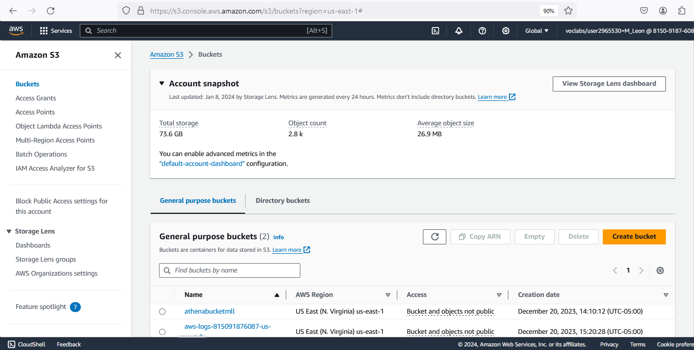
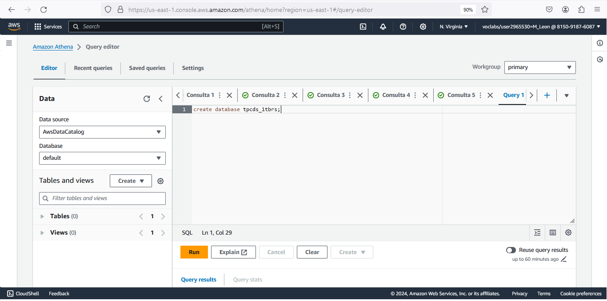

# Non Functional characteristics of Distribuited Systems into the Big Data alternative tool in AWS Cloud

**Introduction**

This tutorial is the demostration of non functional properties Distribuid Systems as cluster concept, performance and fault tolerance, throught the experiments of an alternative Big Data tool for Athena usable in some use of cases, specifically EMR Cluster with Spark.

**Context for the tutorial**

The following subsections provide a brief overview of how this tutorial fits into the broader context of Big Data as Distribuid Systems with their main characteristics and how with the steps to build and experimental tool it achieve to demostrate the non functional properties.
You will be able to run this tutorial in a Learner Lab environment of AWS Academy.

**Tutorial objectives**

This tutorial will teach you how to:
Use services and tools of AWS for Big Data.
Prepare an environment of benchmark Big Data with TPC-DS with Cloud Architecture.
Set and launch a cluster of Elastic Map Reduce with Spark.  
Demostrate the fault tolerance characterstic of distribuited systems.
Demostrate the performance property.
Demostrate the cluster concept.

**Intended audience**
This tutorial is intended for students of grade or postgraduate in Computer Sciences or relative, and who are interested in gaining expertise with charactersitcs of distribuited systems and some specific knowledge of big data analysis on AWS.
Prerequisites
Students should already have dominated the theory od Distribuited Systems and basic knowledge of Big Data, tools and services of AWS.
# Sections
This tutorial has the following parts:
1. [Process to setup of TPC-DS Benchmark Environment in AWS.](#process-to-setup-of-tpc-ds-benchmark-environment-in-aws)
2. [Demostration of Cluster Concept.](#demostration-of-cluster-concept)
3. [Setup and run EMR Cluster with access to the TPC-DS Big Data repository.](#setup-and-run-emr-cluster-with-access-to-the-tpcds-big-data-repository)
4. [Demostration of Performance.](#demostration-of-performance)
5. [Demostration of Fault Tolerance.](#demostration-of-fault-tolerance)
   
## Process to setup of tpc-ds benchmark environment in aws

Is important to mention that this demo excercise can be excecuted in an Lab Learner Environment that as a prerequisite we have to setup the Athena Tool for Big Data Querys, creating a bucket as repository needed.
The following two images show how to configure the prerequisite to use Athena, first creating a bucket S3 and after setting it using "Edit Settings" for the right functionning of Athena:


Once Athena is configured we have to do the following steps:

1\. This work uses the following official repository of [AWS Labs for Redshift utils](https://github.com/awslabs/amazon-redshift-utils/tree/master/src/CloudDataWarehouseBenchmark/Cloud-DWB-Derived-from-TPCDS/1TB) using specifically the TPC-DS of 1 TB size. The script file ddl.sql has the sentences to create the tables of the database but using Redshift that is a product of AWS to store large volumes of data.

2\. We have to create this tables but in S3 files. For this we will use Athena to run the scripts but first we must change the following:
- Creation of database with the following code:
```
CREATE DATABASE tpcds_1tbrs;
```


3\. Modify the script of creation of table with the following:
- Start the script with "create external table".
- Change the data types "integer", "int8" or ""int4" to "int" and "numeric" to "decimal" keeping the precision.
- Delete the definitions of "primary key".
- Delete the null definition of the fields.
- Finally write the following block of code and make reference to a s3 files to populate the data, the location in this case is s3://redshift-downloads/TPC-DS/2.13/1TB/customer_address/. e.g. location and next between quotes the link to s3 repository:
```
  ROW FORMAT SERDE 'org.apache.hadoop.hive.serde2.lazy.LazySimpleSerDe'
WITH SERDEPROPERTIES ('field.delim' = '|')
STORED AS INPUTFORMAT 'org.apache.hadoop.mapred.TextInputFormat' OUTPUTFORMAT 'org.apache.hadoop.hive.ql.io.HiveIgnoreKeyTextOutputFormat'
LOCATION 's3://redshift-downloads/TPC-DS/2.13/1TB/date_dim/'
TBLPROPERTIES (
  'classification' = 'csv',
  'write.compression' = 'GZIP'
);
```


4\. You must repeat this step for every table of tpc-ds benchmark, you have to make sure of chosing de database previous to excecute every script of creation. For our experiment we created in first instance four tables: date_dim, item, store and store_sales, tables used in the query number 67a in this repository https://github.com/awslabs/amazon-redshift-utils/tree/master/src/CloudDataWarehouseBenchmark/Cloud-DWB-Derived-from-TPCDS/1TB/queries.

5\. Finally the tables will be ready to be accesed throught the data source type: AWS Glue Data Catalog in order to be ready for the tpcds data to be accessed from the EMR Clusters with only activate one property.

## Demostration of cluster concept
We recommend to read the official documentation about Architecture of EMR Cluster for understand the functioning of the AWS EMR Cluster service in the following links: https://docs.aws.amazon.com/emr/latest/ManagementGuide/emr-overview-arch.html https://docs.aws.amazon.com/emr/latest/ManagementGuide/emr-what-is-emr.html
Is important to mention that the AWS service of EMR Cluster can provide some types of tecnologies being the main: Hadoop, Presto or Spark, we use this last because of best times of excecution of querys in another work related.

## Setup and run emr cluster with access to the tpcds big data repository
The following images show the main configurations to set up a Cluster of EMR of Apache Spark:

1\. After of making click in "Create Cluster" into the EMR Cluster service will appear the next screen, you have to enter a name for the cluster, then by default will be choosen the last version of EMR Cluster and then you have to make click in the application package called "Spark Interactive", notice you the automatic check in the differente software above.

2\. The next property is the key to connect the Cluster with the data layer created in the section: [Process to setup of TPC-DS Benchmark Environment in AWS.](#process-to-setup-of-tpc-ds-benchmark-environment-in-aws) You will have to check the property: "Use for Spark table metadata":


3\. The next image shows the configuration for service role and instance role, in both choosing default roles.


4\. The next image shows the configuration of provisioning nodes to the cluster. In this point is important remember the restrictions of use the tool EMR within a Lab Environment of AWS. The main restrinctions of use are: 
| **Restriction** | **value** |       
| ------------------------------ | --------- |  
| **Max. vCPU** | 32 concurrent running |
| **Max. number of nodes** | 9 concurrent running |
| **EC2 Instance size** | large o smaller |
  
> Note: Is important to know that EC2 instances of `size large` has 8 GB of memory RAM, this is the most important fact in this tutorial, because of the Apache Spark uses the memory as its main resource, Spark load the tables in memory and thus be faster: https://aws.amazon.com/es/what-is/apache-spark/.


5\. Finally the cluster created has the following information: 


> Note: Don't forget allow the access to the core node of the cluster enabling in the inbound rules the ssh port from your ip.

In summary bellow we describe the important configurations to take into account: 
| **Config file attribute name** | **value** |       
| ------------------------------ | --------- |      
| **spark version** | 3.4.1 (This is equivalent to the spark version in EMR 6.15) |
| **key-name** | Provide the name of your EC2 key pair |
| **identity-file**      | Provide the full path of the key pair you downloaded. For example: `/home/ec2-user/environment/master2-us-east-1-ec2-key-pair.pem`|
| **Instance-type**      | m4.large |
| **region** | Your test region. Make sure the source data has been copied to the test region. For example: `us-east-1`|
| **instance-profile-name** | `EMR_EC2_DefaultRole` Make sure this role exists in your account. By default EMR creates this role when launched on the Management console. You can manually create this role by running: `aws emr create-default-roles` Please refer the [CLI doc](https://docs.aws.amazon.com/cli/latest/reference/emr/create-default-roles.html). |
| **num-task-nodes**         | 7                                           |
| **num-primary-nodes**         | 1                                           |
| **num-core-nodes**         | 1                                           |

## Demostration of Performance
Here official links of AWS service called Cloud Watch that allows monitoring and visualize metrics in 3 dimensions of a EMR Cluster: of the cluster state, state of nodes, and inputs and outputs as S3, hard disk, memory, among others: https://aws.amazon.com/es/cloudwatch/.
The next two images show the review of the dashboard with metrics predesign for cluster state, these indicators allows to know the health and performance in realtime while the cluster is processes of differents jobs running their steps and the component negotiator for more resources (YARN). This metrics can be reviewed even in the past.


The next two images show the dashboard of metrics predesign for node state allowing watch indicators of health and performance of all nodes of the EMR cluster: nodes running, pending, rebooting or nodes with problems.


The final images of this section show the dashboard of metrics predesign for inputs and outputs of the cluster, the mst important here for our experiment is the indicators of memory (because of Spark technology) but also show metrics about storage. In our case this last indicators are not relevant because of the experiment connect the cluster with metadata in S3 described in the first section of this tutorial, that is the hard disk is not used in operations with data throughout this work.


## Demostration of Fault Tolerance
Fault tolerance is a very important property for a system that offer services even when one or more component faults (Priti Kumari and Parmeet Kaur, 2021). As idea general this tutorial is derived from a doctoral thesis work that search alteratives to compare Athena AWS, queries of tpc-ds benchmark of 1TB could be excecuted in Athena but due to the lack of resources by restrictions in Learner Lab same queries could not run in the EMR Cluster with Spark.
As a practical example to demostrate the fault tolerance in a EMR Cluster, we begin by excecuting the basic query in Athena that counts the records of the largest table https://www.tpc.org/TPC_Documents_Current_Versions/pdf/TPC-DS_v3.2.0.pdf in the longest delayed query (number 67) of TPC-DS according to this work related (https://www.concurrencylabs.com/blog/starburst-enterprise-vs-aws-emr-sql-tpcds/).
Finally the excecution of the query took almost 3 seconds being the result the number 287'999.764.


You have to connect to the node core with a terminal using ssh throught its public direction with the user default: ec2-user and using the key pair before created. 
Next you need elevate privileges to root. 
After you ought to enter to the environment of Spark to launch querys with spark-sql tool. 
Remember before to run the query place in the database previously created with command "use".
> Note: Every sentence excecuted in spark-sql have to finish with the symbol ;.

The following is a list of commands used in the proccess decribed:
```
sudo su -
spark-sql
use tpcds1tbrs;
``` 
You will note that the same query before excecuted in Athena in the EMR Cluster take 78 seconds approximately, this due the spark first load in memory of cluster the 287 millions and more of records. The size of one record of the table store_returns is 134 bytes, that is the cluster need a capacity of almost 36 GB in our experiment with TPC-DS database og 1 TB.
If you remember the restrictions the capacity of cluster was of 9 cluster of size large of EC2 instances, that is 8 GB of memory per node having a total of 72 GB of mmory in cluster. Remember also that there are others process or component inside the cluster that need memory as the operative system and so.


## Bibliography
https://www.guru99.com/blockchain-tutorial.html (available online 20XX)
Priti Kumari and Parmeet Kaur, "A survey of fault tolerance in cloud computing," 2021 Journal of King Saud University - Computer and Information Sciences, pp. 1159-1176, doi: 10.1016/j.jksuci.2018.09.021.
https://www.tpc.org/TPC_Documents_Current_Versions/pdf/TPC-DS_v3.2.0.pdf
