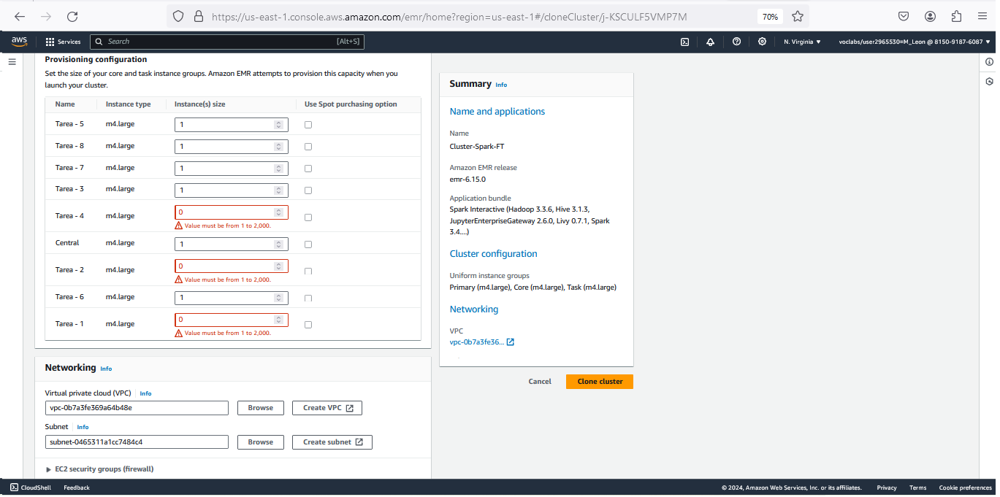

# Non Functional characteristics of Distribuited Systems into the Big Data alternative tool in AWS Cloud

**Introduction**

This tutorial is the demostration of non functional properties Distribuid Systems as cluster concept, performance and fault tolerance, throught the experiments of an alternative Big Data tool for Athena usable in some use of cases, specifically EMR Cluster with Spark.

**Context for the tutorial**

The following subsections provide a brief overview of how this tutorial fits into the broader context of Big Data as Distribuid Systems with their main characteristics and how with the steps to build and experimental tool it achieve to demostrate the non functional properties.
You will be able to run this tutorial in a learner lab environment of AWS Academy.

**Tutorial objectives**

This tutorial will teach you how to:
Use services and tools of AWS for Big Data.
Prepare an environment of benchmark Big Data with TPC-DS with Cloud Architecture.
Set and launch a cluster of Elastic Map Reduce with Spark.  
Demostrate the fault tolerance characterstic of distribuited systems.
Demostrate the performance property.
Demostrate the cluster concept.

**Intended audience**
This tutorial is intended for students of grade or postgraduate in Computer Sciences or relative, and who are interested in gaining expertise with charactersitcs of distribuited systems and some specific knowledge of big data analysis on AWS.
Prerequisites
Students should already have dominated the theory od Distribuited Systems and basic knowledge of Big Data, tools and services of AWS.
# Sections
This tutorial has the following parts:
1. [Process to setup of TPC-DS Benchmark Environment in AWS.](#process-to-setup-of-tpc-ds-benchmark-environment-in-aws)
2. [Setup and run EMR Cluster with access to the TPC-DS Big Data repository.](#setup-and-run-emr-cluster-with-access-to-the-tpc-ds-big-data-repository)
3. [Demostration of Cluster Concept.](#)
4. [Demostration of Performance.](#)
5. [Demostration of Fault Tolerance.](#)
   
## Process to setup of tpc-ds benchmark environment in aws

Is important to mention that this demo excercise can be excecuted in an Lab Learner Environment that as a prerequisite we have to setup the Athena Tool for Big Data Querys, creating a bucket as repository needed.
The following two images show how configure the prerequisite to use Athena, first creating a bucket S3 and then setting it using "Edit Settings" for the right functionning of Athena:


Once Athena is configured we have to do the following steps:

1\. This work uses the following official repository of [AWS Labs for Redshift utils](https://github.com/awslabs/amazon-redshift-utils/tree/master/src/CloudDataWarehouseBenchmark/Cloud-DWB-Derived-from-TPCDS/1TB) using specifically the TPC-DS of 1 TB size. The script file ddl.sql has the sentences to create the tables of the database but using Redshift that is a product of AWS to store large volumes of data.

2\. We have to create this tables but in S3 files. For this we will use Athena to run the scripts but first we must change the following:
- Creation of database with the following code:
```
CREATE DATABASE tpcds_1tbrs;
```


3\. Modify the script of creation of table with the following:
- Start the script with "create external table".
- Change the data types "integer", "int8" or ""int4" to "int" and "numeric" to "decimal" keeping the precision.
- Delete the definitions of "primary key".
- Delete the null definition of the fields.
- Finally write the following block of code and make reference to a s3 files to populate the data, the location in this case is s3://redshift-downloads/TPC-DS/2.13/1TB/customer_address/. e.g. location and next between quotes the link to s3 repository:
```
  ROW FORMAT SERDE 'org.apache.hadoop.hive.serde2.lazy.LazySimpleSerDe'
WITH SERDEPROPERTIES ('field.delim' = '|')
STORED AS INPUTFORMAT 'org.apache.hadoop.mapred.TextInputFormat' OUTPUTFORMAT 'org.apache.hadoop.hive.ql.io.HiveIgnoreKeyTextOutputFormat'
LOCATION 's3://redshift-downloads/TPC-DS/2.13/1TB/date_dim/'
TBLPROPERTIES (
  'classification' = 'csv',
  'write.compression' = 'GZIP'
);
```


4\. You must repeat this step for every table of tpc-ds benchmark, you have to make sure of chosing de database previous to excecute every script of creation. For our experiment we created in first instance four tables: date_dim, item, store and store_sales, tables used in the query number 67a in this repository https://github.com/awslabs/amazon-redshift-utils/tree/master/src/CloudDataWarehouseBenchmark/Cloud-DWB-Derived-from-TPCDS/1TB/queries.

5\. Finally the tables will be ready to be accesed throught the data source type: AWS Glue Data Catalog in order to be ready for the tpcds data to be accessed from the EMR Clusters with only activate one property.

## Demostration of Cluster Concept.
We recommend to read the official documentation about Architecture of EMR Cluster for understand the functioning of the AWS EMR Cluster service: https://docs.aws.amazon.com/emr/latest/ManagementGuide/emr-overview-arch.html
Is important to mention that the AWS service of EMR Cluster can provide some types of tecnologies being the main: Apache Hadoop, Hive, Presto or Apache Spark, we use this last because of best times of excecution of querys in another work related. https://docs.aws.amazon.com/emr/latest/ManagementGuide/emr-what-is-emr.html 
https://aws.amazon.com/es/emr/features/spark/

## Setup cluster with access to the tpc-ds big data repository
The following images show the main configurations to set up a Cluster of EMR of Apache Spark:
1\. After of making click in "Create Cluster" into the EMR Cluster service will appear the next screen, you have to enter a name for the cluster, then by default will be choosen the last version of EMR Cluster and then you have to make click in the application package called "Spark Interactive", notice you the automatic check in the differente software above.

2\. The next property is the key to connect the Cluster with the data layer created in the section 1: [Process to setup of TPC-DS Benchmark Environment in AWS.](#process-to-setup-of-tpc-ds-benchmark-environment-in-aws).


3\. The next image show the configuration of provisioning nodes to the cluster. In this point is important remember the restrictions of use the tool EMR within a Lab Environment of AWS. The main restrinctions of use are: HERE TABLE Number of nodes (not more than 9), Types of Instances of EC2: not bigger than large. Memory RAM: Not more than . And another restrictions. The most important for this case using Apache Spark is the memory, remember that Spark load the tables in memory and thus be faster. 




7. We wil use the  two ways for : manual for down te server and scripts  
> Note: We use 3TB dataset in the [examples](./examples), if you'd like to change to 100G or 1T, don't forget to change the parameter `Scale factor (in GB)` in the job submission scripts. Spark executor configuration should also be adjusted correspondingly.

| **Config file attribute name** | **value** |       
| ------------------------------ | --------- |      
| **spark version** | 3.3.0 (This is equivalent to the spark version in EMR 6.9) |
| **spark download-source**| "https://archive.apache.org/dist/spark/spark-3.3.0/spark-3.3.0-bin-hadoop3.tgz"      |
| **hdfs version** | 3.3.4 |
| **hdfs download-source** | "https://archive.apache.org/dist/hadoop/core/hadoop-3.3.4/"|
| **key-name** | Provide the name of your EC2 key pair |
| **identity-file**      | Provide the full path of the key pair you downloaded. For example: `/home/ec2-user/environment/master2-us-east-1-ec2-key-pair.pem`|
| **Instance-type**      | c5d.9xlarge |
| **region** | Your test region. Make sure the source data has been copied to the test region. For example: `us-east-1`|
| **ami** | `ami-05fa00d4c63e32376`  (The AMI for `us-east-1` used for this testing was: `ami-05fa00d4c63e32376 (Amazon Linux 2 AMI (HVM), SSD Volume Type (64-bit x86))`. AMIs get updated periodically. Please make sure you use the correct AMI for your region.)|
| **instance-profile-name** | `EMR_EC2_DefaultRole` Make sure this role exists in your account. By default EMR creates this role when launched on the Management console. You can manually create this role by running: `aws emr create-default-roles` Please refer the [CLI doc](https://docs.aws.amazon.com/cli/latest/reference/emr/create-default-roles.html). |
| **ebs-optimized**      | Yes                                         |
| **launch**             |                                             |
| **num-slaves**         | 6                                           |
| **install-hdfs**       | True                                        |
| **install-spark**      | True                                        |
| **java-version**       | 8                                           |

## Demostration of Performance.


## Demostration of Fault Tolerance.
With this we have created our environment witch we can connect from every eam cluster started through the property glue connection. The following Lab shows how perform the fault tolerance in a cluster. We will start a cluster of spark for execute one heavy query and we will do down one server for show that this affects but not in all the process.\ 


